# Lock Screen Clock Preview

## AviumUI Official Themes

<table>
  <tr>
    <td align="center">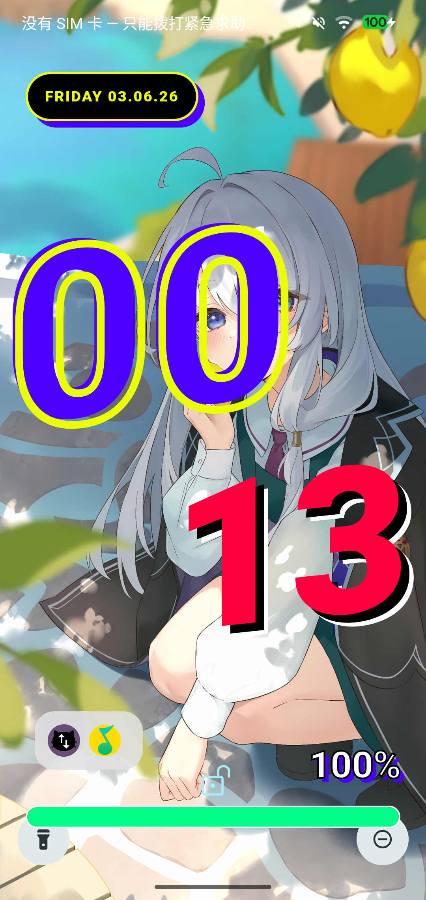 <b>1. Acid Geometry</b></td>
    <td align="center">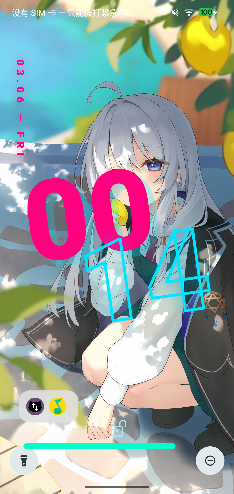 <b>2. Avant-Garde Clock</b></td>
    <td align="center">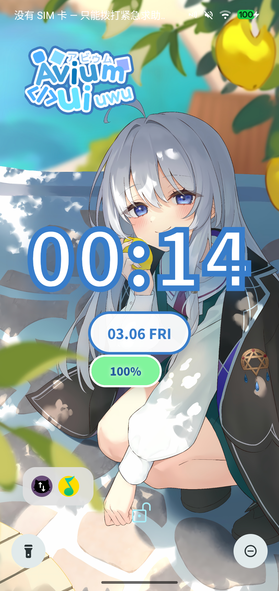 <b>3. Avium Clock</b></td>
  </tr>
  <tr>
    <td align="center">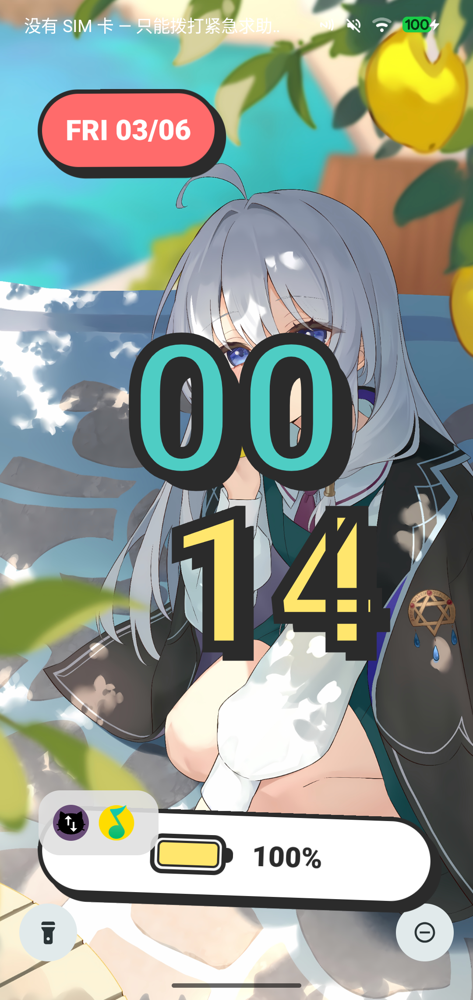 <b>4. Cartoon Pop</b></td>
    <td align="center">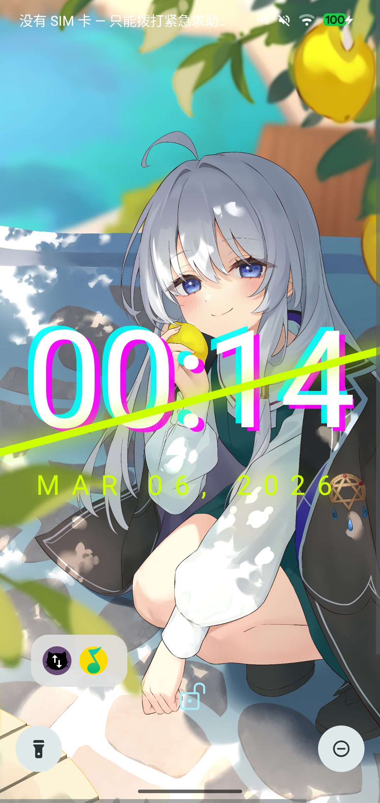 <b>5. Chroma Slice</b></td>
    <td align="center">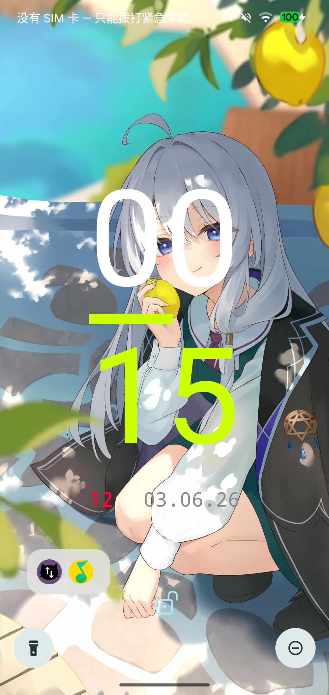 <b>6. Cyber Minimal</b></td>
  </tr>
  <tr>
    <td align="center">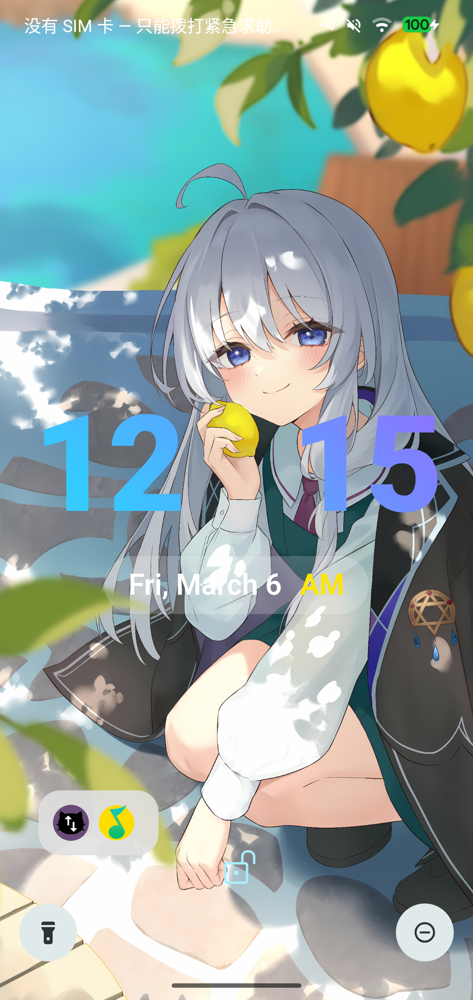 <b>7. Fluid Gradient</b></td>
    <td align="center">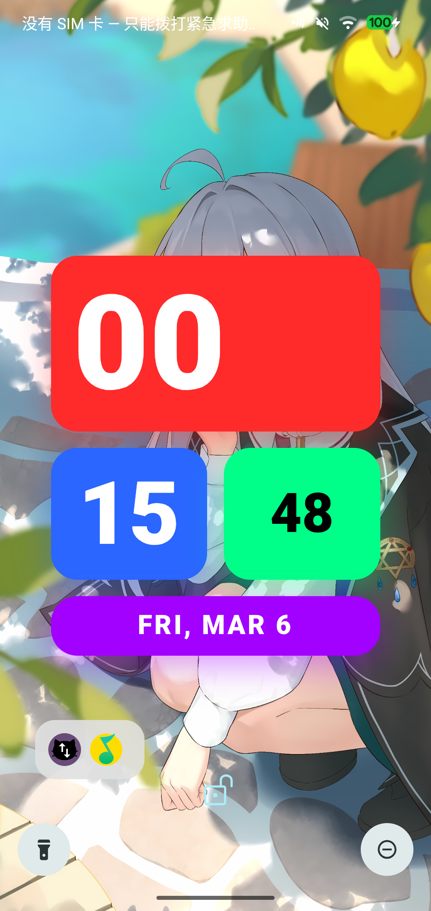 <b>8. Neon Grid</b></td>
    <td align="center">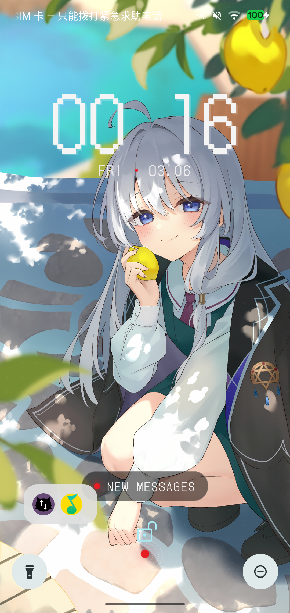 <b>9. Pixel Clock</b></td>
  </tr>
  <tr>
    <td align="center">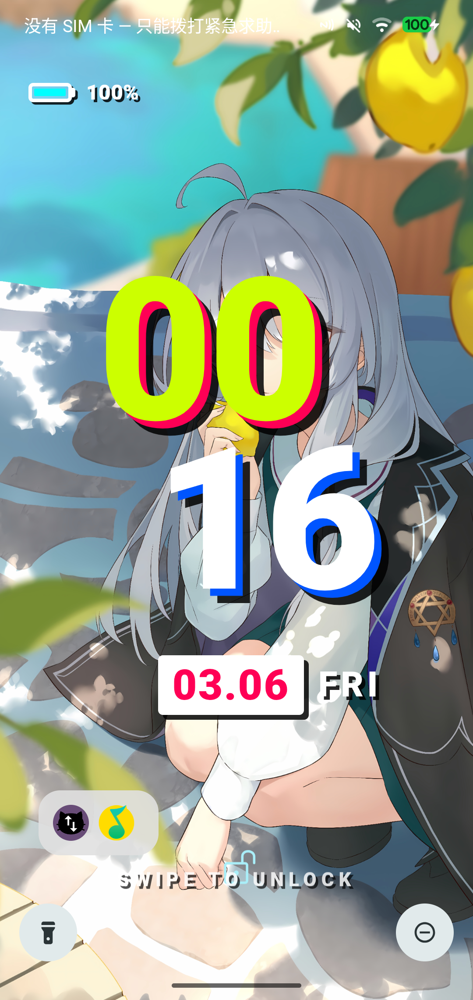 <b>10. Pop Brutalism</b></td>
    <td align="center">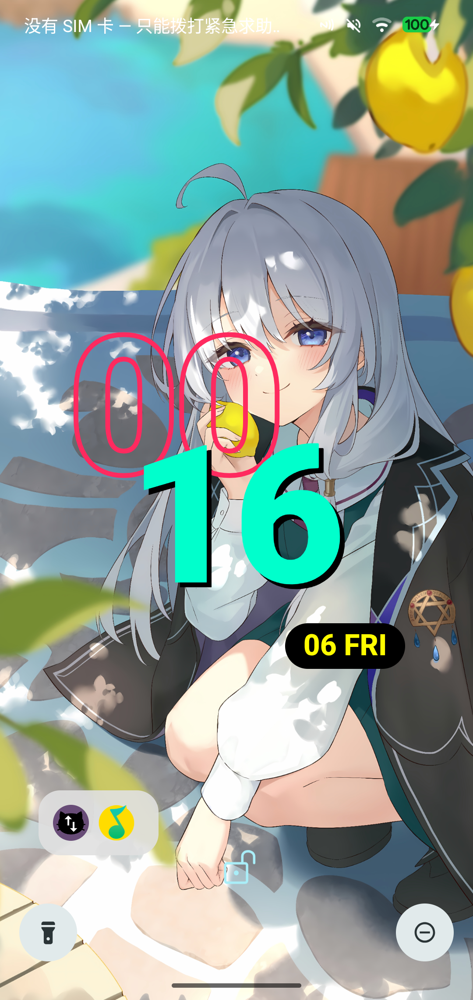 <b>11. Typographic Overlap</b></td>
    <td></td>
  </tr>
</table>
